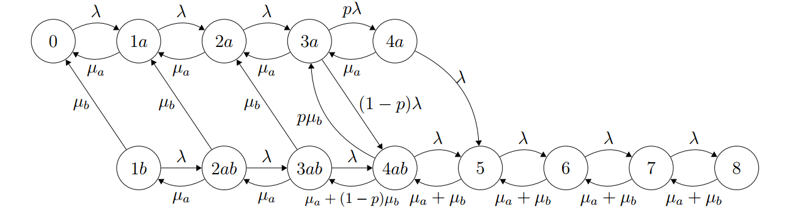

# Queuing Systems

## Lab 1

- Introduction to Poisson and exponential distributions

## Lab 2

- Theoretical overview of $M/M/1$ queue
- $M/M/1$ queue analysis using `MATLAB`
- Comparison of systems with 2 servers: $M/M/2$ queue vs 2 parallel $M/M/1$ queues
- Birth-Death Process: $M/M/1/K$ queue

## Lab 3

- Comparison between $M/M/1$ and $M/D/1$ queues
- $M/M/1/10$ queue simulation
- $M/M/1/5$ queue simulation (varying departure rates $\mu_i$)

## Lab 4

- $M/M/N/K$ system (call center)
- Call center Analysis & Design
- Call Center with two dissimilar servers

## Lab 5

- Series Network
- Networks with alternative routing

## Lab 6

- Window Flow Control
- Buzen's Algorithm
- Closed Queuing Network Simulation

## Simulation

- $M/M/2/8$ queue with threshold and random activation